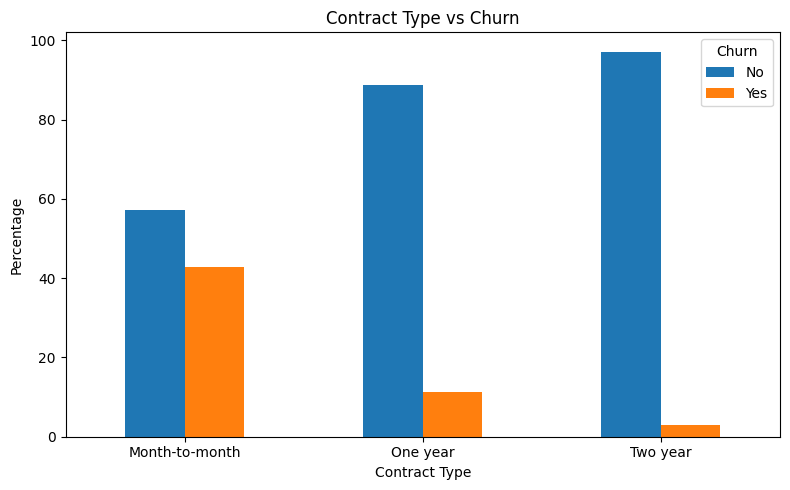
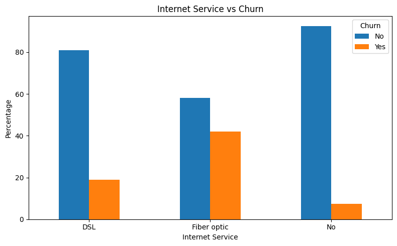
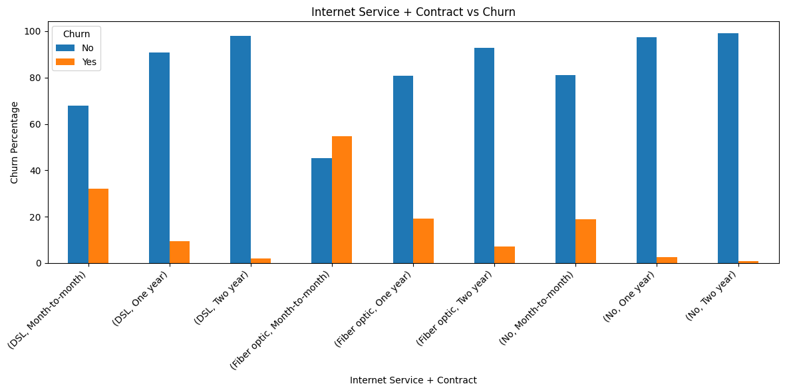
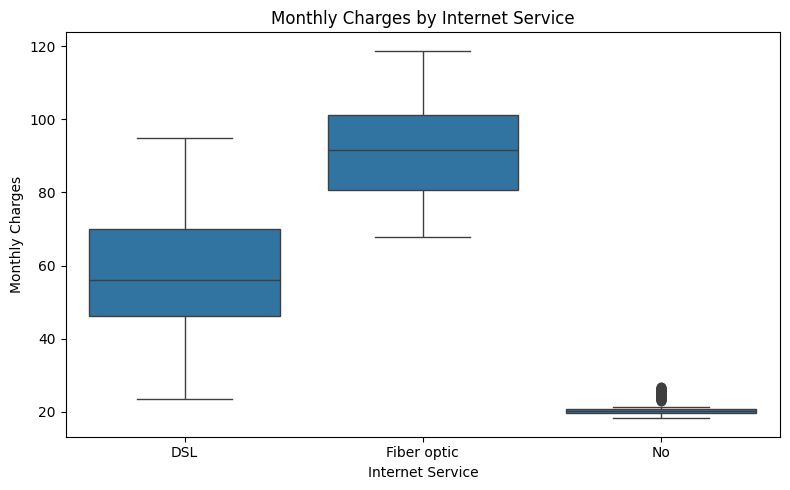
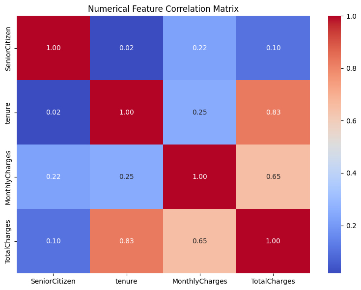

# 📊 Customer Churn Prediction & Retention Risk Analysis

An end-to-end machine learning project for identifying telecom customers at higher risk of churn and understanding the factors associated with customer retention.

## 📌 Project Overview

Customer churn is an important business problem for subscription-based companies. This project analyzes customer behavior, identifies major churn patterns, compares classification models, and develops a model that can support proactive customer retention efforts.

The project covers:

- Data cleaning
- Exploratory Data Analysis (EDA)
- Feature preparation
- Categorical encoding
- Numerical feature scaling
- Classification modeling
- Model comparison
- Hyperparameter tuning
- Threshold analysis
- 5-fold cross-validation
- Feature importance
- Business recommendations

## 🎯 Objective

Build a machine learning classification model capable of identifying customers at higher risk of churn while understanding the customer characteristics most strongly associated with churn.

## 📊 Dataset

The project uses a telecom customer churn dataset containing **7,043 customer records**.

The target variable is:

- `Churn` — whether the customer discontinued the service

Important customer attributes include:

- Contract
- Tenure
- MonthlyCharges
- TotalCharges
- InternetService
- OnlineSecurity
- TechSupport
- PaymentMethod
- PaperlessBilling
- Partner
- Dependents

## 🧹 Data Cleaning

`TotalCharges` was stored as a text/object variable and contained blank values.

The blanks were converted to numeric values and handled as `0.0`, consistent with the observation that these records had zero tenure.

The `customerID` column was removed before model development because it is an identifier rather than a predictive customer characteristic.


## 🔍 Exploratory Data Analysis

Several customer characteristics were analyzed to understand observed churn patterns.

### Key observations

- **Contract type** showed a strong relationship with churn, with month-to-month customers representing an important high-risk segment.
- **Tenure** was an important predictive feature, with customers in the early stages of their relationship showing higher observed churn.
- **Internet service** was associated with different churn patterns across customer segments.
- **Internet service + contract combinations** were analyzed to identify higher-risk customer groups.
- **Monthly charges** were compared across different internet service categories.
- Additional churn rates were analyzed across services such as:
  - OnlineSecurity
  - OnlineBackup
  - DeviceProtection
  - TechSupport
  - StreamingTV
  - StreamingMovies
  - PaymentMethod

### Important segment finding

The combination of **Fiber Optic internet service + Month-to-Month contract** showed an observed churn rate of **54.61%** in the analysis.

> These findings represent observed/predictive associations and should not be interpreted as causal relationships.
### Visualizations

#### Contract vs Churn



#### Internet Service vs Churn



#### Internet Service + Contract vs Churn



#### Monthly Charges by Internet Service



#### Numerical Feature Correlation



## 🤖 Machine Learning Approach

The prepared dataset was used to develop and compare multiple classification models for churn prediction.

### Models Evaluated

- Logistic Regression
- Decision Tree
- Random Forest
- Additional classification approaches evaluated during experimentation

### Model Development Process

The workflow included:

1. Train-test split
2. Numerical feature scaling
3. Categorical feature encoding
4. Model training
5. Performance comparison
6. Hyperparameter tuning
7. 5-fold cross-validation
8. Final evaluation on the held-out test set

## 🎯 Model Evaluation

The models were evaluated using classification metrics appropriate for a churn prediction problem, including:

- Accuracy
- Precision
- Recall
- F1-score
- ROC-AUC
- Confusion Matrix

Because churn identification is particularly concerned with identifying customers who may leave, recall and ROC-AUC were considered alongside accuracy rather than relying on accuracy alone.

### Model Performance

| Model | Accuracy | Churn Precision | Churn Recall | Churn F1 | ROC-AUC |
|---|---:|---:|---:|---:|---:|
| Logistic Regression | 0.81 | 0.657 | 0.559 | 0.604 | 0.8420 |
| Decision Tree | 0.72 | 0.480 | 0.492 | 0.480 | 0.6477 |
| Tuned Decision Tree | 0.80 | 0.630 | 0.567 | 0.600 | 0.8275 |
| Random Forest | 0.79 | 0.630 | 0.487 | 0.550 | 0.8185 |
| **Tuned Random Forest** | **0.76** | **0.532** | **0.767** | **0.629** | **0.8431** |

### Cross-Validation

The tuned Random Forest achieved a mean **5-fold ROC-AUC of 0.8490 ± 0.0129**, indicating relatively consistent performance across the validation folds.

## ⚙️ Hyperparameter Tuning

`GridSearchCV` was used to systematically search for improved model configurations.

The tuning process used **5-fold cross-validation** to obtain a more reliable estimate of model performance during model selection.

## 🏆 Final Model

The final Random Forest model achieved a **ROC-AUC of 0.843 on the held-out test set**.

ROC-AUC was used as an important evaluation metric because it measures how effectively the model separates customers who churn from customers who remain.

## 🔎 Feature Analysis

Feature importance was analyzed to understand which customer characteristics contributed most strongly to the model's churn predictions.

The analysis was used to connect the machine learning results back to the customer segments identified during EDA.


## 💡 Business Insights

The analysis identified several customer segments and characteristics associated with higher churn risk.

Key observations include:

- Month-to-month contracts represent an important churn-risk segment.
- Customers with shorter tenure showed higher churn risk.
- Fiber Optic customers showed elevated churn compared with other internet-service segments in the analysis.
- Contract type, tenure, and service-related variables provided useful predictive information.
- Combining customer characteristics provided additional insight beyond analyzing individual variables independently.

## 📈 Retention Recommendations

Based on the observed churn patterns, potential retention strategies include:

1. **Target month-to-month customers** with personalized retention offers and incentives to move toward longer-term contracts.
2. **Focus on early-tenure customers** with onboarding support and proactive engagement.
3. **Investigate Fiber Optic customer experience** to understand the factors contributing to the higher observed churn.
4. **Use churn-risk scores** to prioritize customers for proactive retention campaigns.
5. **Monitor customer service and support interactions** for segments showing elevated churn risk.

These recommendations are based on observed patterns and model-driven risk analysis rather than causal conclusions.

## ⚠️ Limitations

- The dataset represents a historical snapshot of customer behavior.
- Model predictions indicate risk and do not establish causation.
- Churn patterns may change as customer behavior and business conditions change.
- The analysis does not include additional factors such as customer complaints, satisfaction scores, competitor activity, or detailed interaction history.
- Further validation would be required before deploying the model in a production retention system.

## 🚀 Future Improvements

Potential extensions of this project include:

- Testing additional classification algorithms.
- Applying probability calibration.
- Performing more detailed threshold optimization based on retention costs.
- Using explainability techniques such as SHAP.
- Building a customer-risk dashboard using Power BI or Tableau.
- Deploying the model as an API.
- Monitoring model performance after deployment.

## 🛠️ Technologies

- Python
- Pandas
- NumPy
- Matplotlib
- Seaborn
- Scikit-learn
- Jupyter Notebook
- Git & GitHub

## 📁 Project Structure

```text
customer-churn-prediction/
│
├── images/
│
├── notebooks/
│   └── customer_churn_analysis.ipynb
│
├── .gitignore
├── README.md
└── requirements.txt
```

👤 Author

**Rakesh Nayak**

Aspiring Data Scientist focused on Python, SQL, Machine Learning, Statistics, and Data Analysis.

[LinkedIn](https://www.linkedin.com/in/rakesh-nenavath/) | [GitHub](https://github.com/rakesh-nenavath/)
